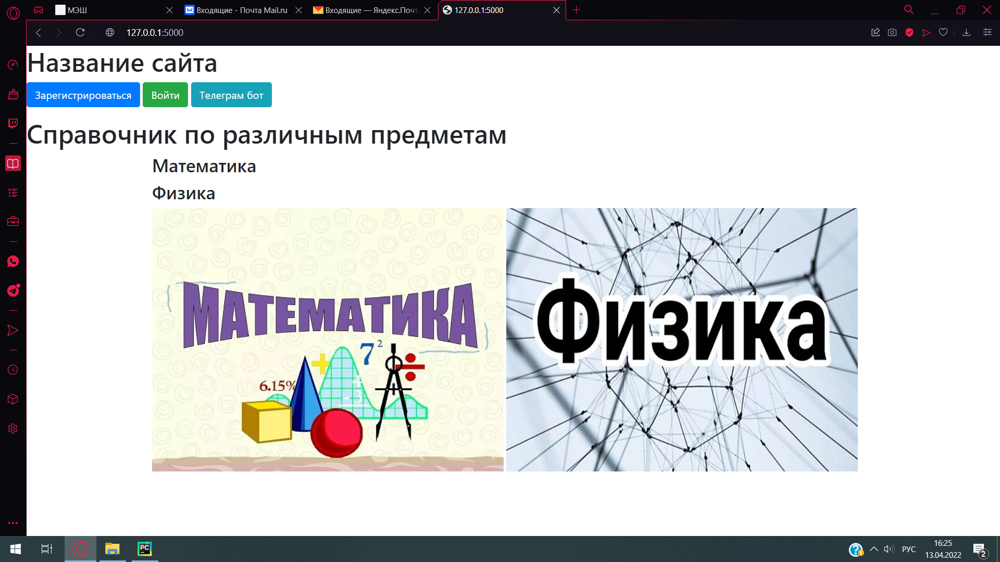
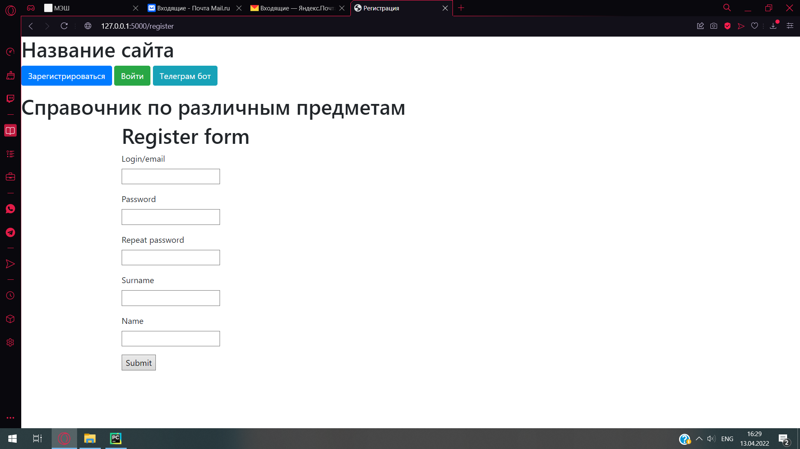
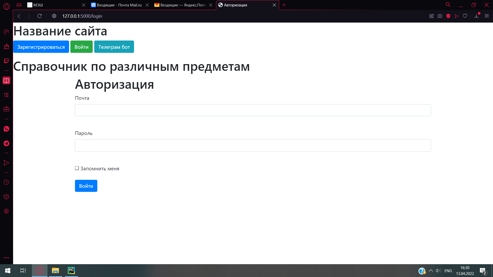
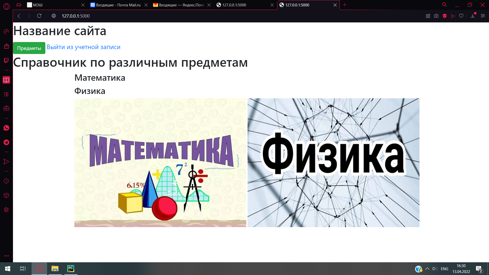

# General Education#

Сайт посвящен школьной тематике.

 

### Описание ### 
* На стартовой странице вебсайта два предмета со справочными материалами, кнопка входа, авторизации и бота. У пользователя есть возможность авторизироваться
* Авторизованные пользователи могут получить доступ к боту, ко справочникам.
* Если пользователь не авторизован (или не зарегистрирован), то он ничего не сможет(пока что), 
ему будет предложено авторизоваться (зарегистрироваться).   
* На главной странице можно выбрать предмет, зарегистрироваться или войти, получить доступ к боту  

* На странице регистрации можно зарегистрироваться  

* На странице авторизации можно войти в аккаунт
 
* На странице выбора предмета(доступен после входа) можно выбрать предмет
 
* Бот имеет два направления: алгебра и физика.  Команды бота 1. Выбор алгебры или физики. 2. Выбор информации по синусам, косинусам, тангенсам и катангенсам(пользователь пишет /угол). Если пользователь выбрал физику, пользователь выбирает из предложенных ему вариантов и получает информацию об ученных.(жмет на кнопку - получает информацию об ученом)
 

 

### Технологии в проекте ###

Приложение написано на языке программирования Python c использованием микро-фреймворка flask. 

В папке templates хранятся HTML-шаблоны. 
При создании форм используется объектный подход с помощью библиотеки flask-wtf.
Веб-приложение работает с базой данных через ORM sqlalchemy.

Все необходимые ресурсы хранятся в папке static. Собственные стили описаны в файле style.css.
Некоторые компоненты (например, панель навигации и аккордион) взяты как шаблоны bootstrap.   
Для красивой первой буквы используется дополнительный шрифт (хранится в папке font). 

Регистрационные данные пользователей, хранятся 
в базе данных SQLite book.db   
Пароли хранятся в БД в хешированном виде. 

### Техническое описание проекта ###
Для запуска приложения необходимо запустить файл main.py  

Тестовый пользователь: ya (пароль: 1) 

Для запуска бота: 
1. Зарегистрировать своего бота и получить API-TOKEN: ( https://core.telegram.org/bots/api )
2. Создать в проекте файл **.env** со следующим содержанием:

```
API_TOKEN=<YOU-API-TELEGRAM-TOKEN>
```

(Чтобы установить все зависимости 
достаточно в консоли (терминале) вызвать команду  
pip install -r requirements.txt

Проект размещен в интернете по адресу: https://abc.herokuapp.com/
